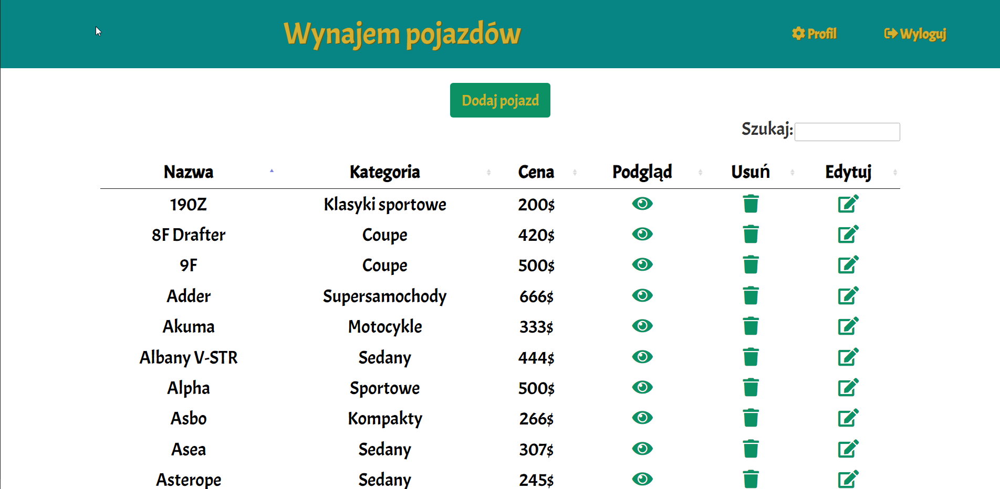

## Spis Treści
* [Informacje o projekcie](#informacje-o-projekcie)
* [Jak uruchomić?](#jak-uruchomić-projekt)
* [Technologie](#technologie)

## Informacje o projekcie
Strona umożliwiająca wynajem samochodów na serwerze RPG w GTA V. Po utworzeniu konta możliwe jest wejście do serwisu i wynajem auta.

## Jak uruchomić?
Aby uruchomić projekt potrzebujemy:
* XAMPP (apache oraz MySQL)
* Skonfigurowaną wysyłkę e-mail

## Technologie
Technologie użyte przy projekcie:
* SASS
* JavaScript
* PHP
* MySQL
